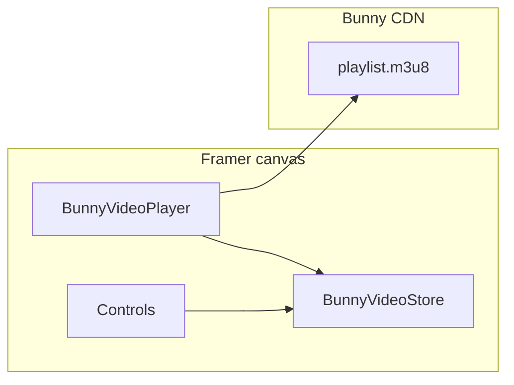

# Architecture

## Components overview

| Piece | Role |
| --- | --- |
| **BunnyVideoPlayer** | `<video>` + HLS (hls.js where needed), lazy load, autoplay policy, optional native controls |
| **BunnyVideoStore** | Shared React state per `storeId` (play, time, volume, quality, hover, etc.) |
| **Controls** | UI that reads/writes the same store — no manual wiring between siblings |
| **BunnyIdleFade** | Optional code override; not tied to the store |

## Store ID

Every Player and control on the **same video** must use the same **Store ID** (default: `default`).

- **Multiple videos on one page:** use a **different Store ID** per video (e.g. `hero`, `card-2`). Autoplay-with-sound uses an audio “floor” so only one unmuted autoplay player wins at a time.
- **Duplicate slides** with the same Store ID intentionally share play state.

## Framer components, variants, and the canvas

Stream Bunny is built for **native Framer layout**, not a single locked embed.

You can place **BunnyVideoPlayer** and any **Controls** **inside your own Framer components** (heroes, cards, players, carousel slides, and so on). Style those wrappers with Framer’s usual tools: Auto Layout, variants, component properties, and breakpoints.

**Why variant animations work:** every Player and control with the same **Store ID** reads and writes **BunnyVideoStore**. Play/pause, time, volume, quality, and hover stay in sync even when pieces live in different layers or variant states. You do not wire events between siblings.

**Typical pattern**

1. Create a Framer **component** (e.g. a video card).
2. Drop **BunnyVideoPlayer** and controls inside it. Set the same **Store ID** on each (default `default`).
3. Use **variants** on the wrapper or on control layers (Default, Playing, Hover, and so on). Animate opacity, position, or scale in Framer while playback state still comes from the shared store.
4. Reuse the component on the canvas; each instance can use its own Store ID if it is a separate video.

That shared store is what makes the UI **fully customizable on the Framer canvas**: the stream is one system, the chrome is your design.

See [Plugin guide — Nest inside Framer components](plugin.md#nest-stream-bunny-inside-framer-components) for a short workflow.

## Stream URLs

The Player builds:

- **Stream:** `https://{cdnHost}/{videoId}/playlist.m3u8`
- **Thumbnail:** `https://{cdnHost}/{videoId}/thumbnail.jpg`

`cdnHost` is **CDN host name** if set; otherwise `vz-{libraryId}.b-cdn.net`.

## Plugin vs manual install

| Mode | What lands in the Framer project |
| --- | --- |
| **Marketplace plugin (default)** | Published `framer.com/m/…` module instances only |
| **Manual** | You paste `components/*.tsx` into Code (see [README](../README.md)) |
| **Maintainer embed** | Plugin injects local `.tsx` when `VITE_STREAM_BUNNY_EMBED_SOURCES=true` — not for end users |

## Pro features

- **BunnyQualityPickerButton** — switches HLS levels via hls.js when multiple renditions exist.
- **BunnyIdleFade** — `withBunnyIdleFade` code override; delay edited in library source.

## Coming soon (not shipped)

The plugin catalog lists **Captions** and **Chapter markers** as upcoming; they are not in the repo yet.
